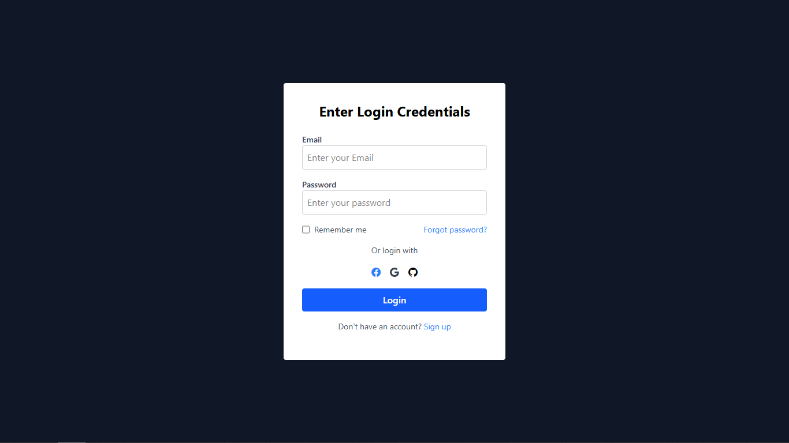

# 🔐 Modern Login Page UI using Tailwind CSS

This is a clean, minimal, and modern **Login Page UI** built using **HTML and CSS**.  
The page includes social login buttons, form validation structure, and responsive design for seamless user experience.

> ✅ Fully static | 💡 Beginner Friendly | 💻 Desktop-first layout (partially responsive) | Responsive

---

## ✨ Features

- 📥 Email and password input fields  
- 🧠 “Remember Me” checkbox  
- 🔑 “Forgot password?” link  
- 🌐 Social login icons (Facebook, Google, GitHub)  
- 🔄 Redirect link to **Sign Up**  
- ⚡ Stylish blue CTA button  
- 🖤 Dark mode background  

---

## 🛠️ Tech Stack

- HTML5  
- CSS3
- Tailwind CSS

---

## 📸 Screenshot



---

## 🚧 Future Enhancements

- Add full responsiveness for mobile devices  
- Integrate real authentication with Firebase or custom backend  
- Form input validation using JavaScript  
- Dark/light mode toggle  

---

## 🏁 How to Run Locally

```bash
1. Clone the repo:
   git clone https://github.com/Deeps1970/login-ui.git

2. Navigate into the folder:
   cd login-ui

3. Open `index.html` in your browser.
```

## 📬 Contact
📧 thiagarajandeepu2007@gmail.com
📞 +91 63832 63688
🌍 Portfolio: https://deeps1970.github.io/Deeps1970/

## 🙌 Credits
Built with ❤️ by Deepak B T
UI inspired by clean authentication layouts from Dribbble and modern SaaS login forms.
